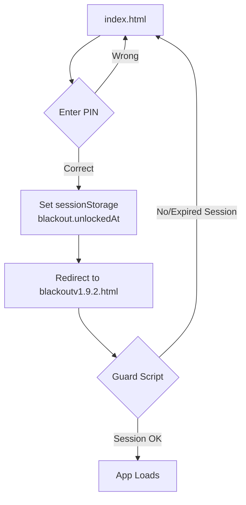

#  Blackout

**Blackout** is a browser-based file encryption and disguise tool.  
It runs entirely client-side using the **WebCrypto API** — no server required.  
Encrypted files can be hidden inside PNG images, exported as raw containers, or wrapped for safer sharing.  
A 4-digit PIN lock adds an optional gate before accessing the app.

---

## ⚙️ How Blackout Works

###  File Encryption
- Algorithm: **AES-256-GCM**
- Key Derivation: **PBKDF2 with SHA-256**
- Iterations: **250,000**
- Salt: **128-bit random (16 bytes)** per file
- IV: **96-bit random (12 bytes)** per file
- Tag length: **128-bit (16 bytes)**
- Key length: **256 bits**
- All crypto is done in the browser with the [WebCrypto API](https://developer.mozilla.org/en-US/docs/Web/API/Web_Crypto_API).

The derived key + random IV are used to encrypt file data.  
AES-GCM produces ciphertext + authentication tag (integrity protection).

###  Output Modes
- **PNG camouflage (default)** → ciphertext is embedded in pixel data.  
  ⚠️ If apps compress/resize the image (e.g., WhatsApp), the data will be corrupted.  
- **`.blackout` container** → raw binary with metadata (salt, iv, tag). Safer for sharing.  
- **`.zip` wrapper (planned)** → wraps `.blackout` for compatibility and integrity.

###  Sharing Notes
- Safest: use `.blackout` or `.zip`, and send as **Document** (not as image).  
- PNG mode should be used only when the transport won’t alter the file.

---

##  Lock Feature (App Gate)

In addition to encryption, Blackout supports a **4-digit PIN lock** for opening the app UI.

- **Storage**:  
  - Lock hash: `SHA-256("blackout-lock-v1" + pin)` → saved in `localStorage`.  
  - Session marker: `sessionStorage["blackout.unlockedAt"]` → set when unlocked, expires after 30 minutes.  
- **Guard Script**:  
  - If lock exists but no session → redirect to `index.html`.  
  - If session expired (>30 minutes) → redirect to `index.html`.  
- Prevents users from opening `blackoutv1.9.2.html` directly.

---

##  Unlock Flow



---

##  Project Structure

```text
/project-root
 ├── index.html              # Lock screen (all-in-one)
 ├── blackoutv1.9.2.html     # Main app (guarded by lock)
 ├── manifest.webmanifest    # PWA manifest
 ├── service-worker.js       # Offline cache + updates
 └── icons/                  # App icons
```

---

Running Locally

 [`https://github.com/Hanserq/Hanserq.github.io.git`](https://github.com/Hanserq/Hanserq.github.io.git)
```bash

git clone https://github.com/Hanserq/Hanserq.github.io.git
cd Hanserq.github.io
npx http-server -p 8080   # use --ssl for mobile testing
Open in browser:
http://localhost:8080/ → Lock screen
Unlock → redirects to blackoutv1.9.2.html

⚠️ Mobile browsers block crypto.subtle on plain HTTP (except localhost). Use HTTPS.

```
---
```markdown

## 🛣️ Roadmap (v1.9.4+)

-   Argon2 KDF (WebAssembly)
-   Nested encryption (“Encrypt Again” onion layers)**
-   Transport armor
  - Prefer `.blackout` / optional `.zip` wrapper
  - Share-safe hints (e.g., “Send as Document”)
  - Filename integrity hash in exports
-   Session improvements
  - Auto-refresh on activity
  - Configurable timeout
-   Inline Notes field** with save/export

```
---

## ⚠️ Security Notes

- PIN lock is **UX gating only**, not strong security.  
- Real security lies in the **AES-GCM file encryption**.  
- Do not embed secrets (API keys, private salts) in the frontend — everything shipped to the client is visible.  
- Encrypted PNGs may break if apps modify them (compression, resizing). Use `.blackout` or `.zip` for safe transfer.

---
